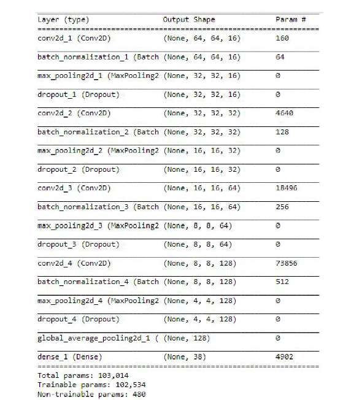

# Arabic-handwriting-character-recognition

#### This is A deep learning model for Arabic handwriting character recognition with accuracy 97.14% .
 
## How to run the code.
you have to install python > 3.7.0, you can download python for windows from here: https://www.python.org/downloads/windows/

### Create Virtual Evironment
```
pip install --upgrade virtualenv
virtualenv  envname
cd envname/
cd bin/
activate
cd ..
cd ..

pip install -r requirements.txt
```
### Run the streamlit app on localhost 
```
streamlit run app.py
```
### Run the trainning script  
```
python train.py
```
### Run the prediction script

```
python predict.py --image use_your_image_local_url
```  
### Run the model on colab
```https://colab.research.google.com/drive/1J_HsZPfzJZTf30RYS4OtwfduI6D_-Pam?usp=sharing```  
## About Dataset.
### 1- Data collection
We will use these datasets **Arabic Handwritten Characters Dataset** for arabic letters.    
link: https://www.kaggle.com/mloey1/ahcd1
All the datasets are csv files representing the image pixels values and their corresponding label.    
Arabic Letters Dataset is composed of **16,800** characters written by 60 participants, the age range is between 19 to 40 years, and 90% of  
participants are right-hand.   
Each participant wrote each character (from ’alef’to ’yeh’) ten times.  
The database is partitioned into two sets: a training set **(13,440 characters to 480 images per class)** and a test set  
**(3,360 characters to 120 images per class).**   
### 2- Data Preprocessing
1-Image Normalization : I rescaled the image's pixel range from [0,255] to be in raneg[0,1] by dividing every pixel in the image by 255 to make them
 normalized.  
2-Encoding Categorical Labels : 
from the labels csv files we can see that labels are categorical values and it is a multi-class classification problem.   
Our outputs are in the form of: Letters from ’alef’ to ’yeh’ have categories numbers from 10 to 37    
Here we will encode these categories values using One Hot Encoding with keras.  
One-hot encoding transforms integer to a binary matrix where the array contains only one ‘1’ and the rest elements are ‘0’  
3-When using TensorFlow as backend, Keras CNNs require a 4D array (which we'll also refer to as a 4D tensor) as input, with shape  
**(nb_samples,rows,columns,channels)**  
where nb_samples corresponds to the total number of images (or samples), and rows, columns,   
and channels correspond to the number of rows, columns, and  channels for each image, respectively.  
So we will reshape the input images to a 4D tensor with following shape (nb_samples, 64, 64 ,1) as we use grayscale images of 64x64 pixels.  
 ## Design Model Architecture  
 In this section I will discuss our CNN Model:  
 1-The first hidden layer is a convolutional layer. The layer has 16 feature maps, which with the size of 3×3 and an activation function which is relu. This is the input layer, expecting images with the structure outlined above.  
 2- The second layer is Batch Normalization which solves having distributions of the features vary across the training and test data. I use it to help in two ways faster learning and higher overall accuracy.  
 3-The third layer is the MaxPooling layer. MaxPooling layer is used to down-sample the input to enable the model to make assumptions about the features so as to reduce overfitting. It also reduces the number of parameters to learn, reducing the training time.
 4-The next layer is a Regularization layer using dropout. It is configured to randomly exclude 20% of neurons in the layer in order to reduce overfitting.  
 5-Another hidden layer with 32 feature maps with the size of 3×3 and a relu activation function to capture more features from the image.  
 6-Other hidden layers with 64 and 128 feature maps with the size of 3×3and a relu activation function to capture complex patterns from the image which will describe the letters later.  
 7-More MaxPooling, Batch Normalization, Regularization and GlobalAveragePooling2D layers.  
 8-The last layer is the output layer with 38 neurons (number of outputclasses) and it uses softmax activation function as we have multi-classes. Each neuron will give the probability of that class.  
 ### Notice the hyperparameters used for the model:
1- Dropout rate: 20% of the layer nodes.  
2- Epochs: 20 then we will fit the model on 20 more epochs.  
3- Batch size: 20.  
4- Optimizer: we will use is Adam.  
5- Activation Layer: we will use is relu activation function.  
6-Kernel initializer: we will use is uniform kernel initializer  
 
  ## Conclusion 
 In this project I built a CNN model which can classify the arabic handwritten images letters.  tested the model on 3600 image with all possible classes and got very high accuracy of 97.14% .  
   ## Deployment
   I used Heroku cloud application platform  to deploy a Streamlit application to test the model on it     
   Kindly use  this deployed model to test: https://arabic-handwriting-characters.herokuapp.com/    
   Using the sample test images in ```images folder ```  
   The deployed model may be crashing because I deployed it on the free version and it dosen't have a gpu  
   
  ## References 
  Datasets References:    
  1- https://www.kaggle.com/mloey1/ahcd1 
  you can download it from this drive : https://drive.google.com/drive/folders/1BiTs1JqvqDZT8rfNnRJDrAP9OTF0mlkl?usp=sharing  
  Topic References:  
  I used MIT research about this topic done by Amr Hendy you can found the research here :  
  https://github.com/AmrHendy/Arabic-Handwritten-Images-Recognition  
  He did a CNN model to Recognise the Arabic letters and digits , I used his final CNN architecture to train the model only on the Arabic letters.
 

